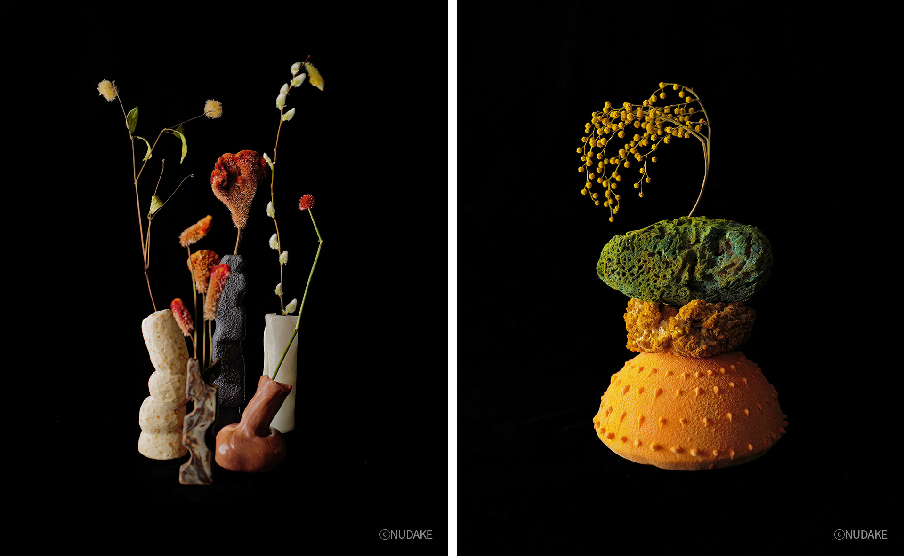
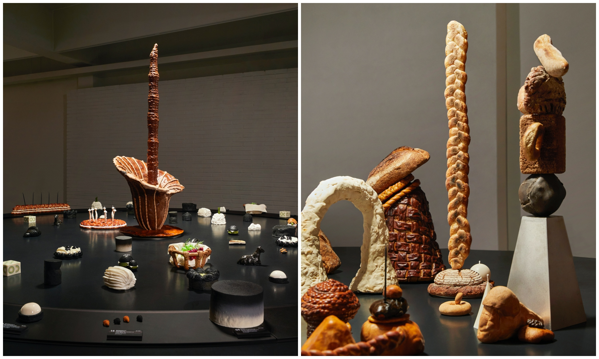
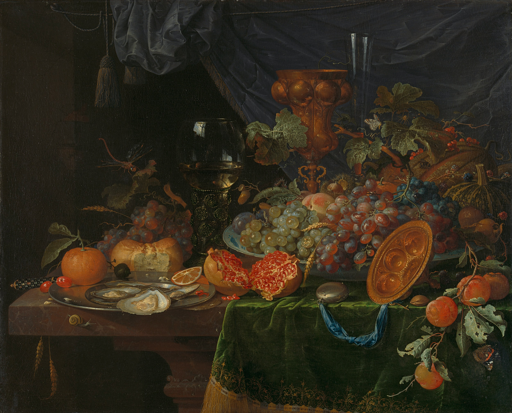

# BUK2 ON&ON

22.10.21

### Design Concept

### main color

이미지 받기

https://korinkorin.tistory.com/89

폴리엄 라이브러리

https://yssa.tistory.com/entry/Python-%ED%8F%B4%EB%A6%AC%EC%97%84Folium-%EB%9D%BC%EC%9D%B4%EB%B8%8C%EB%9F%AC%EB%A6%ACLibrary

카카오 지도 API

https://developers.kakao.com/

profile_ 사진 넣기

https://tothefullest08.github.io/django/2019/06/20/Django25_relations4_OneToOne_Profile/

하늘쌤

http://www.skyggle.com/discussion/5

사용자 인증

https://bangseogs.tistory.com/103

이메일 인증

https://swarf00.github.io/2018/12/14/logout.html

modal

https://cholol.tistory.com/552

# ToDoList

DB 

1. 검색창, 지도 데이터 카카오 API 불러오기 (이번주 주말)

   

Frontend

1. 대문페이지가 별로...  Wo We Are와의 관계 다시 만들기
2. 사진 업로드시 하나씩 submit 버튼 보여주기
3. 사진 업로드 시 미리 보여주는 customized widgets

참고 site

https://www.sweetcheeksq.com/

for 문

https://forum.djangoproject.com/t/how-to-create-dynamic-modals-popups-in-template/8338/6

https://parkhyeonchae.github.io/2020/04/11/django-project-23/

https://carami.tistory.com/61

https://thalals.tistory.com/143
